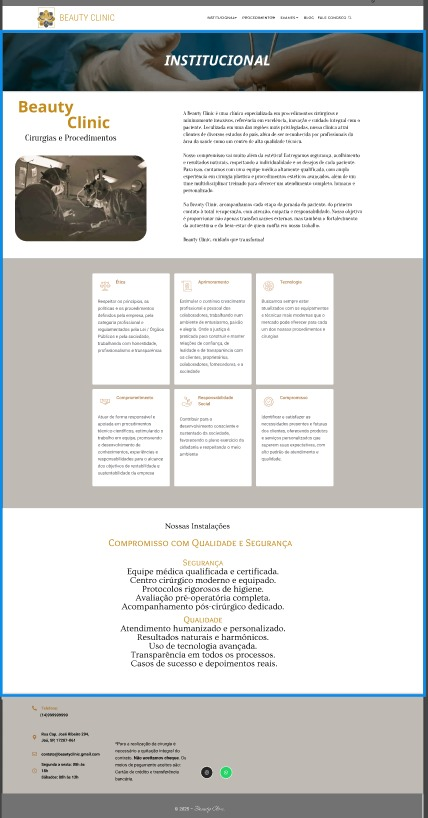
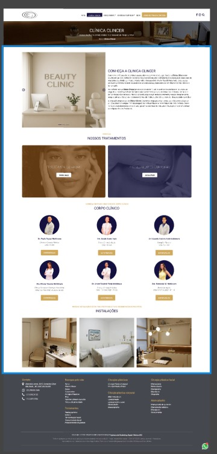
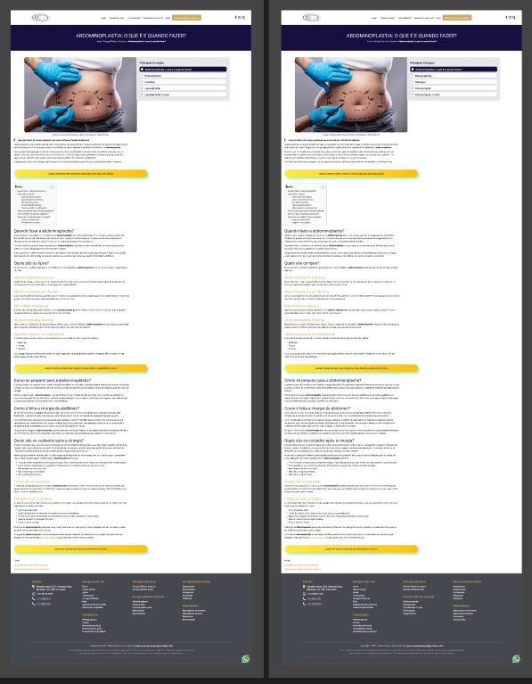
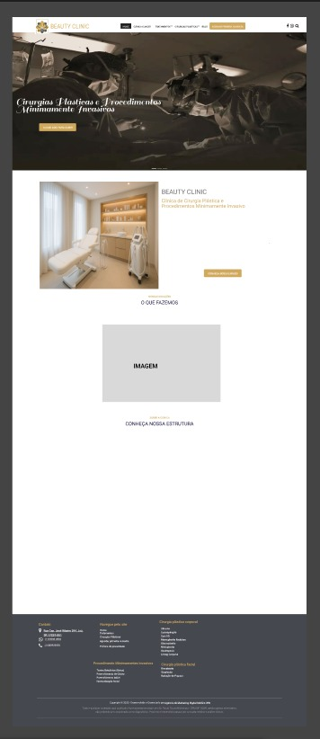

# BeautyClinic

**Uma Solução Inovadora para Conectar Pacientes a Cirurgias Plásticas e Procedimentos Estéticos Minimante Invasivos**

---

**Equipe**

- [@Anacorrea791](https://github.com/anacorrea791)
- [@KaiqueSpilari](https://github.com/KaiqueSpilari)
- [@larissa016](https://github.com/larissa016)
- [manuela582279](https://github.com/manuela582279)

---

**Orientadores** 

- [@ProfCastello](https://www.github.com/ProfCastello)
- [@ProfCristianoDePaula](https://www.github.com/ProfCristianoDePaula)

---
**Nosso objetivo**

O objetivo da nossa empresa é eliminar a insegurança dos indivíduos, promovendo uma elevação significativa da autoestima. O diferencial da nossa empresa reside no fato de que não nos limitamos a um único procedimento específico, mas, sim, oferecemos uma abordagem ampla, com a inclusão de Procedimentos Estéticos Minimamente Invasivos. Além disso, prezamos pela segurança de nossos clientes, permitindo-lhes a liberdade de escolher o médico de sua preferência, assegurando assim a confiança no processo e nos resultados.

---

**O Problema:**

O projeto busca tornar mais acessíveis e seguras as informações sobre procedimentos estéticos e cirurgias plásticas, oferecendo uma plataforma com dados confiáveis, agendamento online, avaliações de profissionais e transparência em custos e resultados.

---

**A Solução:**

Uma plataforma digital que reúne informações confiáveis sobre procedimentos estéticos e cirurgias plásticas, permite agendamento online com profissionais verificados, oferece estimativas de custos, conteúdo educativo e suporte pré e pós-procedimento. A ideia é tornar o acesso mais seguro, prático e transparente para quem busca esses serviços.

---

**📱 Tecnologia Inteligente na Estética:**

A plataforma utiliza inteligência artificial para personalizar recomendações de procedimentos com base no perfil do usuário.

Funciona de forma contínua, oferecendo conteúdo, sugestões e alertas mesmo quando o usuário não está ativo.

Os dados coletados (de forma anônima e segura) ajudam a mapear tendências, melhorar a experiência e otimizar a jornada do paciente.

---

**Sobre a BeautyClinic:**

**💎 Recomendações de beleza:** 
Sugestões personalizadas de procedimentos e cuidados estéticos.

**💄 Consulta fácil:**
Agendamento online com profissionais verificados.

**🌸 Transparência:**
informações claras sobre os procedimentos, custos e avaliações.

---

**Protótipo Institucional:**

---

**Protótipo site principal:**

---

**Protótipo site principal parte 02:**

---

**Protótipo site principal parte 03:**

---

**🌼 Desenvolvimento promissor**

**Beleza com Consciência:** Unimos excelência em procedimentos estéticos a práticas sustentáveis, reforçando nosso compromisso com a saúde e o meio ambiente.

**Atitude Sustentável:** Promovemos a conscientização sobre o impacto ambiental e adotamos medidas que reduzem o desperdício e incentivam o uso consciente de recursos.

**Inovação e Crescimento:** Apostamos em iniciativas que conectam tecnologia, responsabilidade e novas possibilidades de expansão para a clínica.

**Responsabilidade Estética:** Acreditamos em uma beleza responsável, que valoriza o bem-estar do paciente e o cuidado com o planeta.

